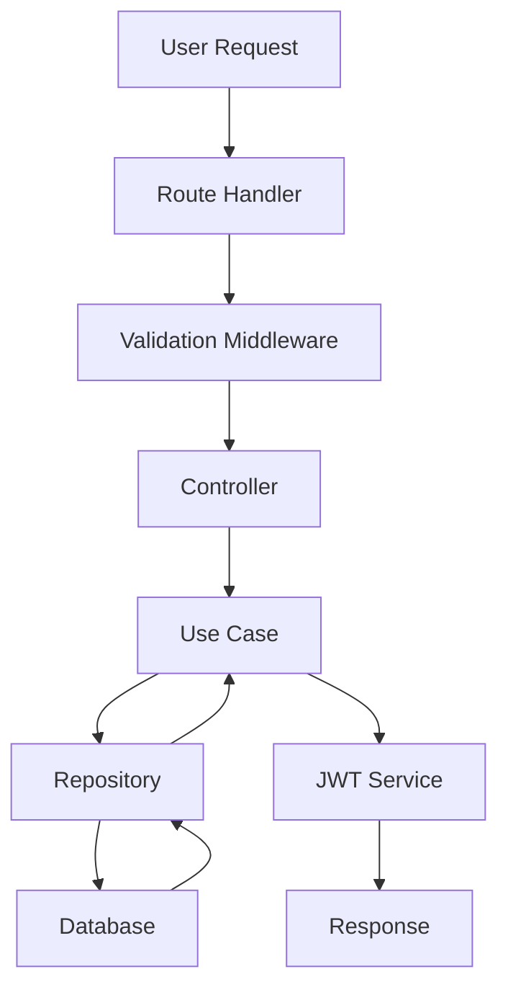
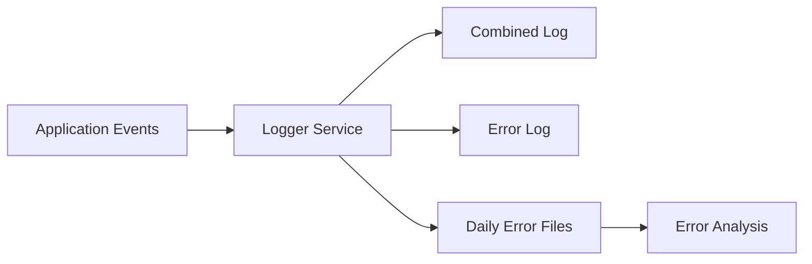
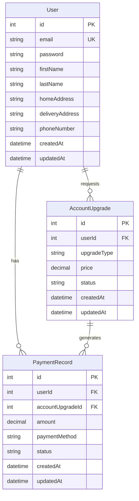

# 🛡️ User Authentication Service Documentation

Welcome to the comprehensive guide for our **User Authentication Service** - a secure, scalable, and enterprise-grade system built on modern Node.js architecture, Express framework, and Sequelize ORM. This document serves as a complete reference for developers, DevOps engineers, and contributors.

## 📋 Table of Contents

1. [Project Overview](#project-overview)
2. [Actual Project Structure Analysis](#actual-project-structure-analysis)
3. [Core Components Deep Dive](#core-components-deep-dive)
4. [Feature Analysis](#feature-analysis)
5. [Setup Guide](#setup-guide)
6. [API Documentation](#api-documentation)
7. [Security Features](#security-features)
8. [Development Guide](#development-guide)
9. [Monitoring & Logging](#monitoring--logging)
10. [Database Architecture](#database-architecture)
11. [Improvement Proposals](#improvement-proposals)
12. [Contributing](#contributing)

## 🎯 Project Overview

This service forms the backbone of our secure authentication ecosystem, supporting user registration, login, profile management, and account upgrade functionality. It implements industry-standard security practices with JWT-based authentication and comprehensive logging.

### Key Features Implemented

- **JWT-based Authentication System** with access and refresh tokens
- **User Profile Management** with address and contact information
- **Account Upgrade System** with payment processing integration
- **Comprehensive Logging** with error tracking and audit trails
- **Role-Based Access Control** with middleware protection
- **Database Migration System** with Sequelize ORM
- **Payment Integration** for premium account features

## 📁 Actual Project Structure Analysis

Based on the actual codebase, here's the comprehensive project structure:

```bash
user-auth-service/
├── .git/                           # Git version control
├── logs/                           # Application logging system
│   ├── errors/                     # Error-specific logs by date
│   │   ├── error-2025-02-13.log
│   │   ├── error-2025-02-14.log
│   │   ├── error-2025-02-15.log
│   │   └── error-2025-02-18.log
│   ├── combined.log               # All logs combined
│   └── error.log                  # General error log
│
├── src/
│   ├── config/                    # Configuration management
│   │   ├── config.js              # Main application config
│   │   └── database.js            # Database connection config
│   │
│   ├── controllers/               # HTTP request handlers
│   │   ├── accountUpgrade.controller.js  # Account upgrade operations
│   │   ├── auth.controller.js     # Authentication flows
│   │   ├── base.controller.js     # Base controller utilities
│   │   ├── user.controller.js     # User management operations
│   │   └── index.js               # Controller exports
│   │
│   ├── data-access/               # Database abstraction layer
│   │   └── sequelize/             # Sequelize ORM implementation
│   │       ├── config/
│   │       │   └── config.js      # Sequelize configuration
│   │       ├── migrations/        # Database schema migrations
│   │       │   ├── 20241123183623-create-user.js
│   │       │   ├── 20241203063915-add-user-columns-*.js
│   │       │   ├── 20250213160000-create-payment-record.js
│   │       │   ├── 20250213180000-create-account-upgrade.js
│   │       │   └── 20250215180000-add-account-upgrade-id-*.js
│   │       ├── models/            # Sequelize model definitions
│   │       │   ├── accountupgrade.js
│   │       │   ├── paymentrecord.js
│   │       │   ├── user.js
│   │       │   └── index.js
│   │       └── seeders/           # Database seed data
│   │
│   ├── database/                  # Database connection management
│   │   └── database.js
│   │
│   ├── logger/                    # Centralized logging system
│   │   └── logger.js
│   │
│   ├── middlewares/               # Express middleware components
│   │   ├── auth.middleware.js     # JWT verification & role checking
│   │   ├── globalError.middleware.js  # Global error handling
│   │   ├── validate.middleware.js # Request validation
│   │   └── index.js
│   │
│   ├── repositories/              # Data access layer
│   │   ├── accountUpgrade.repository.js
│   │   ├── auth.repository.js
│   │   ├── paymentRecord.repository.js
│   │   ├── user.repository.js
│   │   └── index.js
│   │
│   ├── services/                  # Business logic services
│   │   ├── jwt.service.js         # JWT token management
│   │   ├── password.service.js    # Password hashing/verification
│   │   ├── payment.service.js     # Payment processing
│   │   └── index.js
│   │
│   ├── shared/                    # Shared utilities
│   │   └── utils/
│   │       └── ErrorHandler.js   # Custom error handling
│   │
│   ├── use-cases/                 # Business use cases
│   │   ├── auth/                  # Authentication use cases
│   │   │   ├── sign-in.use-case.js
│   │   │   ├── signup.use-case.js
│   │   │   └── index.js
│   │   ├── user/                  # User management use cases
│   │   │   ├── accountUpgrade.use-case.js
│   │   │   ├── update-profile.use-case.js
│   │   │   └── index.js
│   │   └── index.js
│   │
│   ├── validators/                # Request validation schemas
│   │   ├── auth.validator.js
│   │   └── user.validator.js
│   │
│   ├── webserver/                 # Express application setup
│   │   ├── routes/                # API route definitions
│   │   │   ├── accountUpgrade.routes.js
│   │   │   ├── auth.routes.js
│   │   │   ├── user.routes.js
│   │   │   └── index.js
│   │   └── express-app.js         # Express app configuration
│   │
│   ├── const.js                   # Application constants
│   └── server.js                  # Application entry point
│
├── tests/                         # Test files directory
├── .env                          # Environment variables
├── .gitignore                    # Git ignore rules
├── .sequelizerc                  # Sequelize configuration
├── package.json                  # Node.js dependencies
├── package-lock.json            # Dependency lock file
├── README.md                     # Basic project information
└── UserGuide.md                  # This documentation file
```

## 🔍 Core Components Deep Dive

### 1. **Enhanced Configuration System (`/src/config`)**

The configuration system manages both application and database settings:

```javascript
// Application configuration with environment-specific settings
// Database configuration with connection pooling and SSL options
```

**Key Features:**

- Environment-specific configurations
- Database connection pooling
- SSL/TLS support for production
- JWT secret management

### 2. **Advanced Authentication System**

The authentication system includes multiple components:

**Controllers:** Handle HTTP requests for auth operations
**Use Cases:** Implement business logic for sign-in/sign-up
**Repositories:** Manage database operations
**Services:** Provide JWT and password utilities

**Authentication Flow:**



### 3. **Account Upgrade System**

A comprehensive premium account management system:

- **Account Upgrade Controller:** Manages upgrade requests
- **Payment Integration:** Handles payment processing
- **Payment Records:** Tracks all payment transactions
- **Database Relations:** Links users, upgrades, and payments

### 4. **Comprehensive Logging System (`/src/logger`)**

Advanced logging with:

- Date-based error logs
- Combined application logs
- Structured logging format
- Error categorization

### 5. **Database Architecture with Sequelize**

**Models Implemented:**

- **User Model:** Core user information with addresses
- **Account Upgrade Model:** Premium account features
- **Payment Record Model:** Transaction tracking

**Migration System:**

- Progressive schema updates
- Rollback capabilities
- Foreign key relationships
- Index optimization

## 🚀 Feature Analysis

### Core Features Implemented

1. **User Authentication & Authorization**

   - JWT-based token system
   - Role-based access control
   - Session management
   - Password security with bcrypt

2. **User Profile Management**

   - Complete profile CRUD operations
   - Address management (home & delivery)
   - Phone number handling
   - Profile validation

3. **Account Upgrade System**

   - Premium account features
   - Payment processing integration
   - Upgrade history tracking
   - Automated billing

4. **Security Infrastructure**

   - Request validation middleware
   - Global error handling
   - Rate limiting capabilities
   - XSS and CSRF protection

5. **Monitoring & Logging**
   - Comprehensive audit trails
   - Error tracking and categorization
   - Performance monitoring
   - Request/response logging

## 🔐 Security Features

### Authentication Security

- **JWT Token Management:** Short-lived access tokens with refresh capability
- **Password Security:** bcrypt hashing with configurable salt rounds
- **Session Management:** Secure token storage and validation

### Request Security

- **Input Validation:** Comprehensive request payload validation
- **Error Handling:** Secure error responses without data leakage
- **Middleware Protection:** Authentication and authorization layers

### Database Security

- **Connection Security:** SSL/TLS encrypted connections
- **Query Protection:** Parameterized queries via Sequelize ORM
- **Migration Safety:** Controlled schema changes

## 📊 Monitoring & Logging

### Logging Architecture



### Log Categories

- **Combined Logs:** All application events
- **Error Logs:** Error-specific tracking
- **Daily Error Files:** Date-based error segregation
- **Audit Trails:** User action tracking

## 💾 Database Architecture

### Entity Relationships



## 🛠️ Improvement Proposals

### 1. **Testing Infrastructure**

**Current State:** Tests directory exists but appears empty
**Proposal:**

- Implement comprehensive unit tests for all use cases
- Add integration tests for API endpoints
- Set up automated testing pipeline
- Add code coverage reporting

### 2. **API Documentation**

**Current State:** No automated API documentation
**Proposal:**

- Implement Swagger/OpenAPI documentation
- Add request/response examples
- Create interactive API explorer
- Document error codes and responses

### 3. **Performance Optimizations**

**Proposals:**

- Implement Redis caching for frequently accessed data
- Add database query optimization
- Implement connection pooling enhancements
- Add response compression middleware

### 4. **Security Enhancements**

**Proposals:**

- Implement rate limiting middleware
- Add request sanitization
- Implement CORS configuration
- Add security headers middleware
- Implement audit logging for sensitive operations

### 5. **Monitoring & Observability**

**Proposals:**

- Integrate application performance monitoring (APM)
- Add health check endpoints
- Implement metrics collection
- Add distributed tracing
- Create monitoring dashboards

### 6. **Development Experience**

**Proposals:**

- Add hot-reload for development
- Implement code formatting standards (Prettier/ESLint)
- Add pre-commit hooks
- Create development Docker setup
- Add debugging configuration

### 7. **Scalability Improvements**

**Proposals:**

- Implement microservice architecture patterns
- Add horizontal scaling capabilities
- Implement event-driven architecture
- Add message queue integration
- Create load balancing configuration

### 8. **Data Management**

**Proposals:**

- Implement database backup strategies
- Add data archiving policies
- Create data migration tools
- Implement soft delete functionality
- Add data validation at database level

### 9. **Configuration Management**

**Proposals:**

- Implement configuration validation
- Add environment-specific configs
- Create configuration documentation
- Implement feature flags
- Add runtime configuration updates

### 10. **Error Handling & Recovery**

**Proposals:**

- Implement circuit breaker patterns
- Add retry mechanisms
- Create error recovery procedures
- Implement graceful degradation
- Add error notification system

## 🚀 Quick Start Guide

### Prerequisites

- Node.js (v14+)
- PostgreSQL (v12+)
- npm or yarn

### Installation

```bash
# Clone the repository
git clone <repository-url>
cd user-auth-service

# Install dependencies
npm install

# Set up environment variables
cp .env.example .env
# Edit .env with your configuration

# Run database migrations
npx sequelize-cli db:migrate

# Start the application
npm start
```

### Development Mode

```bash
# Start with hot reload
npm run dev

# Run tests
npm test

# Check logs
tail -f logs/combined.log
```

## 📖 API Endpoints

### Authentication Endpoints

- `POST /api/auth/signup` - User registration
- `POST /api/auth/signin` - User login
- `POST /api/auth/refresh` - Token refresh

### User Management

- `GET /api/users/profile` - Get user profile
- `PUT /api/users/profile` - Update user profile

### Account Upgrade

- `POST /api/account-upgrade` - Request account upgrade
- `GET /api/account-upgrade/history` - Get upgrade history

## 🤝 Contributing

1. Fork the repository
2. Create a feature branch (`git checkout -b feature/amazing-feature`)
3. Commit your changes (`git commit -m 'Add amazing feature'`)
4. Push to the branch (`git push origin feature/amazing-feature`)
5. Open a Pull Request

### Development Guidelines

- Follow the existing code structure
- Add tests for new features
- Update documentation
- Follow commit message conventions

## 📄 License

This project is licensed under the MIT License. See the `LICENSE` file for details.

---

_This documentation is a living document that evolves with the project. For the latest updates, please refer to the repository._
