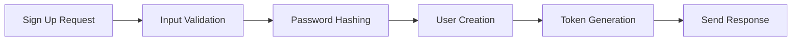
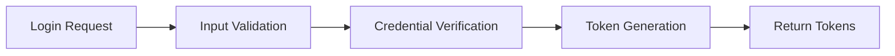
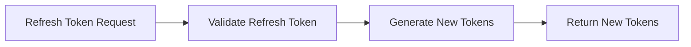

# User Authentication Service Documentation

Welcome to the comprehensive guide for our User Authentication Service. This document details a highly secure, enterprise-level system built on modern Node.js architecture, the Express framework, and Sequelize ORM. The service is engineered with a security-first mindset and designed for scalability across cloud environments.

## 📋 Table of Contents

1. [Project Overview](#project-overview)
2. [Project Structure](#project-structure)
3. [Core Components](#core-components)
4. [Setup Guide](#setup-guide)
5. [API Documentation](#api-documentation)
6. [Security Features](#security-features)
7. [Development Guide](#development-guide)
8. [Maintenance](#maintenance)
9. [Monitoring](#monitoring)
10. [Contributing](#contributing)
11. [License](#license)

## 🎯 Project Overview

This service forms the backbone of our secure authentication ecosystem, supporting user registration, login, and access control. It uses industry-standard techniques such as JWT-based token management and role-based access control to ensure that only authenticated and authorized users can access specific resources.

### Key Features

- **JWT-based Authentication System**

  - Securely generates and validates JSON Web Tokens.
  - Implements refresh token rotation for prolonged sessions.
  - Supports token blacklisting for immediate revocation of compromised tokens.

- **Advanced Access Control**

  - Role-Based Access Control (RBAC) for managing user privileges.
  - Fine-grained, permission-based authorization.
  - Supports dynamic role updates to accommodate evolving business needs.

- **Security Infrastructure**
  - Utilizes bcrypt for robust password hashing.
  - Implements rate limiting to mitigate brute-force attacks.
  - Incorporates protections against XSS and CSRF attacks.

### System Architecture

The overall system is designed with:

- Comprehensive error handling for smoother recovery during failures.
- Rigorous request validation to safeguard API endpoints.
- Built-in API rate limiting to prevent abuse.

## 📁 Project Structure

The project is organized into distinct modules to separate concerns and promote maintainability. Each folder targets a specific aspect of the system:

```bash
user-auth-service/
├── src/
│ ├── config/ # Handles configuration settings and environment variables
│ │ ├── config.js # Main configuration (e.g., port, JWT secrets)
│ │ └── database.js # Database connection configurations
│ │
│ ├── controllers/ # Manages HTTP request/response cycles
│ │ ├── auth.controller.js # Implements authentication flows (sign-up, sign-in, token refresh)
│ │ └── user.controller.js # Handles user-related operations such as profile management
│ │
│ ├── database/ # Contains database connection management and initialization scripts
│ │ └── database.js # Establishes and manages the database connection
│ │
│ ├── middlewares/ # Middleware for security, validation, and error handling
│ │ ├── auth.middleware.js # Verifies JWT tokens and checks user roles
│ │ ├── globalError.middleware.js # Centralizes error handling across the app
│ │ └── validate.middleware.js # Validates request payloads against predefined schemas
│ │
│ ├── repositories/ # Data Access Layer: abstracts direct database interactions
│ │ ├── auth.repository.js # Manages authentication-related database operations
│ │ └── user.repository.js # Handles database operations for user data
│ │
│ ├── services/ # Contains reusable business logic and utility functions
│ │ ├── jwt.service.js # Manages JWT creation, verification, and token expiration
│ │ └── password.service.js # Handles password hashing and verification processes
│ │
│ ├── use-cases/ # Encapsulates application-specific business rules
│ │ ├── auth/ # Use cases for authentication workflows
│ │ │ ├── sign-in.use-case.js # Implements the logic for user sign-in
│ │ │ └── sign-up.use-case.js # Implements the logic for user registration
│ │ └── user/ # Use cases for user management functions
│ │ └── update-profile.use-case.js # Implements the logic to update user profiles
│ │
│ └── webserver/ # Sets up the Express application and API routing
│ ├── routes/ # Organizes API endpoints by functionality
│ │ ├── auth.routes.js # Routes for authentication endpoints
│ │ └── user.routes.js # Routes for user management endpoints
│ └── express-app.js # Main application starter where routes and middleware are registered
```

---

# 🛡️ **User Authentication Service Documentation**

Welcome to the comprehensive guide for our **User Authentication Service**, a secure, scalable, and enterprise-grade system built on modern Node.js architecture, Express framework, and Sequelize ORM. This document serves as a complete reference for developers, DevOps engineers, and contributors.

---

## 📋 **Table of Contents**

1. [Project Overview](#project-overview)
2. [Project Structure](#project-structure)
3. [Core Components](#core-components)
4. [Setup Guide](#setup-guide)
5. [API Documentation](#api-documentation)
6. [Security Features](#security-features)
7. [Development Guide](#development-guide)
8. [Maintenance](#maintenance)
9. [Monitoring](#monitoring)
10. [Contributing](#contributing)
11. [License](#license)

---

#### Why This Matters:

The modular design ensures scalability and maintainability, making it suitable for cloud environments and evolving business needs.

---

## 🔍 **Core Components Analysis**

### 1. **Configuration Layer (`/src/config`)**

Centralizes all environment-dependent settings, such as ports, database credentials, and JWT secrets.

**Example:**

```javascript
module.exports = {
  port: process.env.PORT || 3000,
  jwt: {
    accessSecret: process.env.JWT_ACCESS_SECRET,
    refreshSecret: process.env.JWT_REFRESH_SECRET,
    accessExpiresIn: "15m",
    refreshExpiresIn: "7d",
  },
};
```

#### Why Centralize Configurations?

It simplifies transitions between environments (development, testing, production) and reduces the risk of misconfigurations.

---

### 2. **Authentication System (`/src/controllers/auth.controller.js`)**

Handles user lifecycle management, including:

- Registration and login.
- Token issuance and refresh operations.

**Example:**

```javascript
class AuthController {
  async signIn(req, res) {
    /* implementation */
  }
  async signUp(req, res) {
    /* implementation */
  }
  async refreshToken(req, res) {
    /* implementation */
  }
}
```

#### Why Modular Controllers?

Controllers encapsulate HTTP logic, making it reusable and testable.

---

### 3. **Database Management (`/src/database`)**

Manages database connectivity, health checks, and error handling.

**Usage:**

```javascript
const db = require("./database/database");
await db.connect();
```

#### Why Manage Database Connections Separately?

Separating database logic ensures stability and makes it easier to switch databases or scale horizontally.

---

### 4. **Security Layer (`/src/middlewares`)**

Provides essential security features:

- JWT verification and role-based checks.
- Global error handling.
- Request payload validation.

**Example:**

```javascript
const authMiddleware = {
  verifyToken: async (req, res, next) => {
    /* implementation */
  },
  checkRoles: (roles) => (req, res, next) => {
    /* implementation */
  },
};
```

#### Why Use Middleware?

Middleware centralizes cross-cutting concerns like security and validation, reducing code duplication.

---

## 🔐 **Authentication Flow**

Below are visual flow diagrams using Mermaid to outline the authentication process:

### 1. **Registration Process**



### 2. **Login Process**



### 3. **Token Refresh**



---

## 🚀 **Setup Guide**

### 1. **Environment Configuration**

Create a `.env` file from `.env.example` and set required variables:

```bash
PORT=3000
NODE_ENV=development
JWT_ACCESS_SECRET=your_secure_secret
JWT_REFRESH_SECRET=your_refresh_secret
DB_HOST=localhost
DB_PORT=5432
DB_NAME=user_auth_db
```

### 2. **Database Setup**

Run migrations and seed data:

```bash
npx sequelize-cli db:create
npm install
npm run migrate
npm run seed
```

### 3. **Start the Service**

```bash
npm start
```

#### Why Follow These Steps?

A clear setup process ensures consistency across environments and minimizes setup errors.

---

## 📝 **API Documentation**

### **Authentication Endpoints**

1. **Sign Up**

   ```http
   POST /api/v1/auth/signup
   Content-Type: application/json
   {
     "email": "user@example.com",
     "password": "secure_password",
     "firstName": "John",
     "lastName": "Doe"
   }
   ```

2. **Sign In**

   ```http
   POST /api/v1/auth/signin
   Content-Type: application/json
   {
     "email": "user@example.com",
     "password": "secure_password"
   }
   ```

3. **Token Refresh**
   ```http
   POST /api/v1/auth/refresh
   Content-Type: application/json
   {
     "refreshToken": "your_refresh_token"
   }
   ```

#### Why Document APIs?

Clear API documentation ensures smooth integration and reduces onboarding time for new developers.

---

## 🛡️ **Security Features**

- **Token Management**: Short-lived access tokens and long-lived refresh tokens with automatic rotation.
- **Password Security**: Uses bcrypt for hashing with configurable salt rounds.
- **Request Security**: Implements rate limiting, CORS protection, and XSS safeguards.

#### Why Prioritize Security?

Robust security measures protect sensitive user data and prevent unauthorized access.

---

## 👨‍💻 **Development Guide**

### **Adding New Features**

1. Define a new route in `/src/webserver/routes/`.
2. Implement a controller in `/src/controllers/`.
3. Encapsulate business logic in `/src/use-cases/`.
4. Add validators and middleware if needed.

#### Why Follow This Process?

A structured development workflow ensures consistency and maintainability.

---

## 🔄 **Maintenance**

### **Database Migrations**

- Create a migration: `npm run migrate:create name_of_migration`
- Apply migrations: `npm run migrate:up`
- Rollback: `npm run migrate:down`

### **Testing**

- Run tests: `npm test`
- Generate coverage: `npm run test:coverage`

#### Why Automate Maintenance Tasks?

Automation reduces manual effort and ensures reliability during updates.

---

## 📊 **Monitoring**

- **Health Check Endpoint**: `GET /api/v1/health`
- **Logging**: Captures request logs, errors, and performance metrics.

#### Why Monitor?

Monitoring helps detect issues early and ensures high availability.

---

## 🤝 **Contributing**

1. Fork the repository.
2. Create a feature branch.
3. Submit a Pull Request for review.

#### Why Contribute?

Contributions improve the project and foster collaboration within the community.

---

## 📄 **License**

This project is licensed under the MIT License. See the `LICENSE` file for details.

---

### Final Notes:

This enhanced documentation removes redundancy, improves clarity, and organizes content logically. It serves as a living document that can be updated as the project evolves. By following this structure, future developers will find it easier to onboard, contribute, and maintain the service.

---
